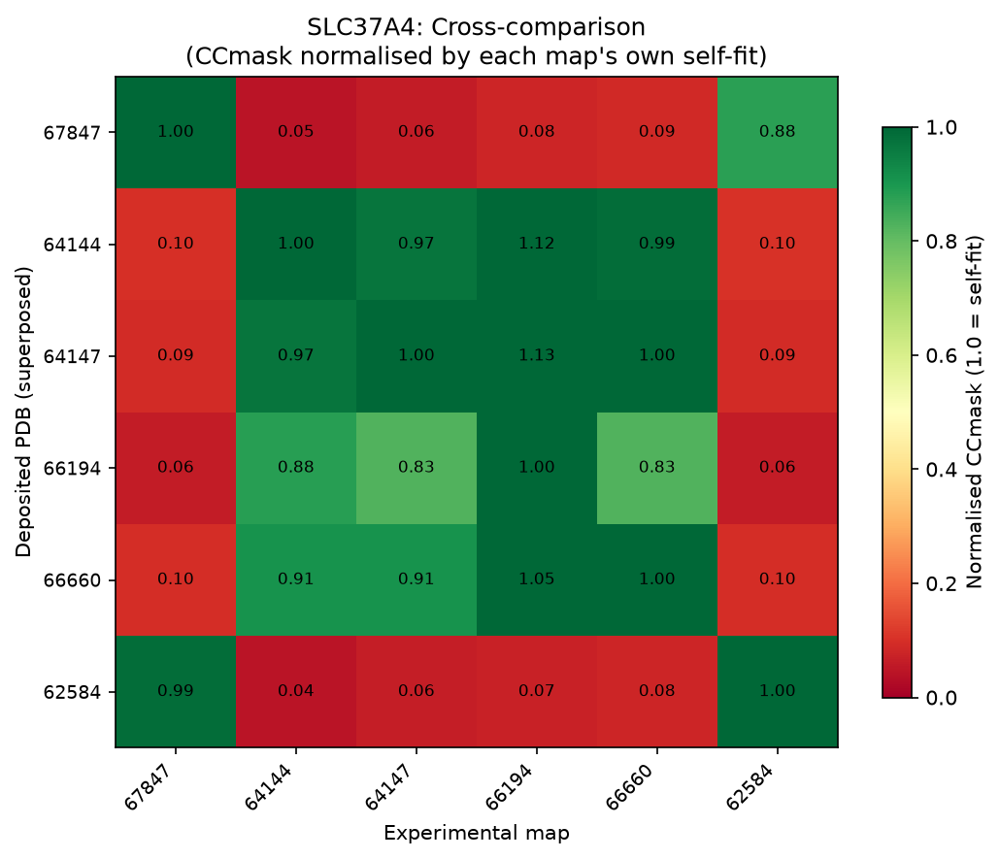

# Generative Ensemble Model Evaluation Against Experimental Cryo-EM Density Maps

Do generative conformational-ensemble models actually sample the functional states that cryo-EM sees? This project benchmarks three ensemble-generation approaches, **BioEmu**, **AlphaFlow**, and **MSA subsampling**, directly against experimentally determined cryo-EM density maps, rather than against molecular dynamics trajectories as most existing benchmarks do.

## Why density maps instead of MD

Generative models of protein conformational ensembles are usually benchmarked against MD simulation. But MD itself only samples a force-field-dependent approximation of the true structural ensemble. A deposited cryo-EM map is a direct, if noisy and resolution-limited, observation of a real conformational state. This project uses that as ground truth instead.

## Dataset

5 multi-conformation membrane transport proteins, 15 EMDB depositions, curated from 58,906 EMDB entries by filtering for single-particle cryo-EM, protein-only samples under 4 Å resolution, then grouping by UniProt ID and requiring at least 2 entries per protein:

| Protein | States | Role |
|---|---|---|
| GltPh | 3 | Genuine multi-state transport cycle |
| SLC37A4 | 6 depositions → 2 real states | Redundant depositions from overlapping studies |
| GPR4 | 2 | Genuine negative control (pH-driven, nearly identical states) |
| SPNS2 | 2 | Genuine multi-state, hardest target in the dataset |
| AUX1 | 2 depositions → 1 real state | Two labs' independent apo depositions, not a real conformational pair |

## Method

1. **Cross-validate the reference dataset first.** Before treating deposition count as ground truth, every deposited structure is scored against every experimental map using masked cross-correlation (CCmask). This is what revealed that SLC37A4's 6 depositions and AUX1's 2 depositions don't mean what their deposition counts imply.
2. **Generate ensembles.** Up to 500 conformations per protein from each of BioEmu, AlphaFlow, and MSA subsampling (via localcolabfold, run on QMUL's Apocrita HPC).
3. **Cluster.** GROMOS/Daura neighbour-counting, gated by Hartigan's dip test for unimodality, so the pipeline doesn't fabricate spurious clusters on ensembles that are genuinely unimodal.
4. **Score.** Every conformation is scored against every experimental map with a resolution-matched, Gaussian-smoothed density-fit metric, normalised against how well the deposited structure itself fits.

## Key findings

**BioEmu matched or outperformed both AlphaFlow and MSA subsampling on every protein, and its margin scaled directly with the true conformational distance between a protein's states**, not a constant offset. A clear lead on SLC37A4 and GltPh, where the real conformational change is large; narrowing to an effective tie on GPR4, where the two states are nearly structurally identical to begin with; converging with the other two models on the same low ceiling on SPNS2, the hardest target in the dataset.

<p align="center">
  
  <br/>
  <em>Best-fitting BioEmu conformation (density_ratio 0.91) against SLC37A4's EMD-66194 density, vs. the deposited structure.</em>
</p>

**Cross-validating the reference dataset caught two things that would have distorted every downstream comparison.** SLC37A4's six depositions are really two structural groups: within-group agreement matched or exceeded each structure's own self-fit, while agreement between the two groups dropped to 0.04–0.10. AUX1's two depositions turned out to be the same apo conformation, solved independently by two different labs (correlating at 0.81–0.83 with each other), not a second functional state at all.

<p align="center">
  
  <br/>
  <em>SLC37A4 cross-comparison: 6 depositions resolve into 2 structurally distinct groups.</em>
</p>

**Panel-by-panel inspection surfaced two things invisible in the summary statistics.** BioEmu's SLC37A4 ensemble correctly sampled both real states even where its own whole-chain RMSD clustering had merged them into a single cluster, meaning the density metric detected real structural heterogeneity the unsupervised clustering step missed. MSA subsampling collapsed outright on AUX1, sampling implausibly broad, unstructured conformations (pairwise RMSD up to ~70 Å, vs BioEmu's 5–25 Å), rather than merely underperforming.

BioEmu's advantage traces specifically to better sampling of large-scale conformational transitions, the kind its Boltzmann-weighted training objective should reward, not a uniform improvement in general structural accuracy.

## Repository structure

```
01_dataset_curation.py     # EMDB query + UniProt-based multi-state filtering
02_build_dataset.py        # builds the final curated dataset table
03_cross_comparison.py     # CCmask cross-validation of the reference structures
04_fitting_bioemu.py       # BioEmu ensemble fitting
04_fitting_msa.py          # MSA subsampling ensemble fitting
04_fitting_alphaflow.py    # AlphaFlow ensemble fitting
shared_fitting.py          # shared clustering / scoring / figure-generation logic
results/                   # per-protein figures, cross-comparison matrices, best-fit structural renders
```

## Compute

All model generation and analysis ran on QMUL's Apocrita HPC (A100 80GB, SLURM), not any external cloud service.

## Author

Qi Shang ([github.com/qshang237](https://github.com/qshang237)) — PhD Candidate, Queen Mary University of London.
